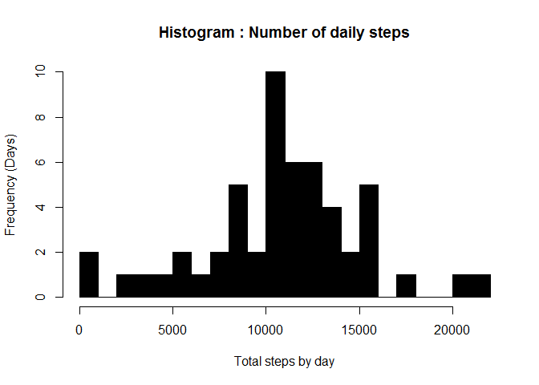
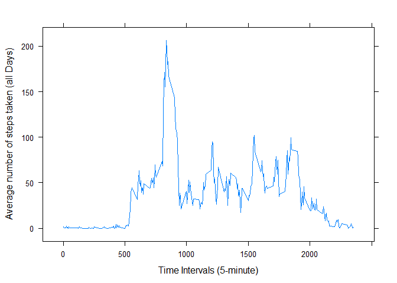
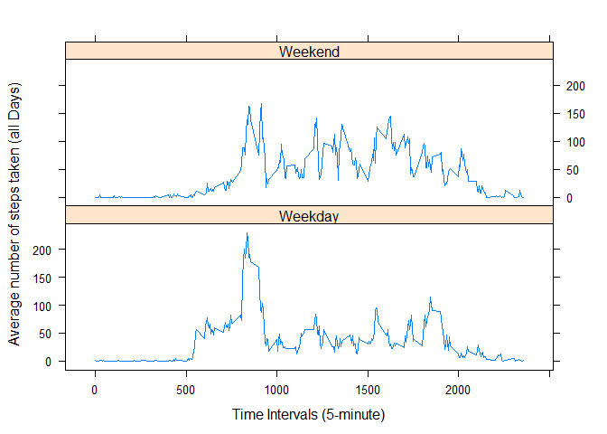

# Reproducible Research: Peer Assessment 1

## Loading and preprocessing the data

```r
unzip("E:/Online Courses/Data Scientists Toolbox/5_Reproducible Research/RepData_PeerAssessment1/activity.zip")
data <- read.csv(file = "activity.csv")
# dim(data)
# str(data)
data$date <- as.Date(data$date,"%Y-%m-%d")
# head(data)
# tail(data)
# sum(is.na(data$steps))
```


## What is mean total number of steps taken per day?

```r
library(plyr)
```

```
## Warning: package 'plyr' was built under R version 3.1.2
```

```r
df1 <- ddply(data, c("date"), summarise, daily_steps = sum(steps))
df1 <- df1[complete.cases(df1),]
mean_daily_steps <- round(mean(df1$daily_steps))
median_daily_steps <- median(df1$daily_steps)
hist(df1$daily_steps,breaks = 20, col="black",xlab="Total steps by day",ylab="Frequency (Days)",main="Histogram : Number of daily steps")
```

 

The mean of the total number of steps taken per day is 1.0766\times 10^{4}.

The median of the total number of steps taken per day is 10765.

## What is the average daily activity pattern?

```r
df2 <- ddply(data, c("interval"), summarise, interval_steps = mean(steps, na.rm = TRUE))
library(lattice)
xyplot(interval_steps~interval, df2, type = "l",xlab="Time Intervals (5-minute)",ylab="Average number of steps taken (all Days)")
```

 

```r
MaxStepsInterval <- df2$interval[which.max(df2$interval_steps)]
```

The 835th (time interval), on average across all the days in the dataset, contains the maximum number of steps.

## Imputing missing values

Missing values are imputed by the combination of


* Linear model fitted on Mean total number of steps taken per day

* Average daily activity pattern 


```r
total_number_NA <- sum(is.na(data$steps))
total_number_NA
```

```
## [1] 2304
```

```r
start_date <- data$date[1]
data$day <- as.numeric(data$date - start_date +1)
df3 <- ddply(data, c("date", "day"), summarise, daily_steps = sum(steps))
df_model <- df3[complete.cases(df3),]
# plot(df3$day, df3$daily_steps)
library(stats)
## Linear model fitted on Mean total number of steps taken per day
fit <- lm(daily_steps ~ day, data = df_model)
model <- fit$coefficients
for (i in 1:nrow(df3)){
        if(is.na(df3$daily_steps[i]) == TRUE){
                df3$daily_steps[i] <- model[1] + df3$day[i]*model[2]
        }
}
## Fractional variation of Average daily activity pattern 
df4 <- ddply(data, c("interval"), summarise, interval_steps = mean(steps, na.rm = TRUE))
df4$interval_steps_fraction <- df4$interval_steps/sum(df4$interval_steps)
# sum(is.na(data$steps))
## Imputing data
imputed_data <- data
for (i in 1:nrow(data)){
        if(is.na(data$steps[i]) == TRUE){                            
        imputed_data$steps[i] <- round(df4$interval_steps_fraction[df4$interval == data$interval[i]]*df3$daily_steps[data$day[i]])
                }
        }
# sum(is.na(imputed_data$steps))
filled_data <- imputed_data
imputed_data <- ddply(imputed_data, c("date", "day"), summarise, daily_steps = sum(steps))
mean_steps <- round(mean(imputed_data$daily_steps))
median_steps <- round(median(imputed_data$daily_steps))
hist(imputed_data$daily_steps,breaks = 20, col="black",xlab="Total steps by day",ylab="Frequency (Days)",main="Histogram : Number of daily steps")
```

 
 
 
The total number of missing values in the dataset is 2304.

The mean of the total number of steps taken per day is 1.0767\times 10^{4}.

The median of the total number of steps taken per day is 1.0779\times 10^{4}.

Yes, these values differ from the estimates from the first part of the assignment.

Frequency of a particular (total number of steps i.e mean value) has increased in the imputed data.

## Are there differences in activity patterns between weekdays and weekends?


```r
day <- weekdays(filled_data$date)
filled_data$day <- ifelse(day == "Saturday" | day == "Sunday", "Weekend", "Weekday")
# head(filled_data)
dat <- ddply(filled_data, c("interval","day"), summarise, interval_steps = round(mean(steps)))
# head(dat)
# tail(dat)
library(lattice)
xyplot(interval_steps~interval | day,dat,type="l",layout=c(1,2),xlab="Time Intervals (5-minute)",ylab="Average number of steps taken (all Days)")
```

 
